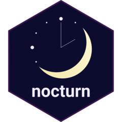

# nocturn 

nocturn provides tools to filter and visualise sleep data.

## Getting started

The easiest way to use nocturn is to visit the [online app](https://shinyserver.bio.ed.ac.uk/app/07_nocturn_app). Visit the [wiki](https://github.com/chronopsychiatry/AMBIENT-BD-nocturn/wiki) for more detailed instructions!

## Can I use nocturn with my data?

nocturn is meant to work with any sleep data that contains either sleep onset and wakeup times (sessions) or timestamped epochs with annotated sleep stages (epochs). This includes for example:

- Data from Somnofy devices
- Data output from the GGIR package (see [Using GGIR data](https://github.com/chronopsychiatry/AMBIENT-BD-nocturn/wiki/Using-GGIR-data) for more details)
- Data in `.edf` format (currently limited support)

nocturn will recognise common variable names (such as "time_at_sleep_onset") automatically. If your variable names are not recognised, they can be set manually in the app (or in R scripts). See [Adjusting column names](https://github.com/chronopsychiatry/AMBIENT-BD-nocturn/wiki/Adjusting-column-names) for details.

If nocturn fails to open your data, or if you would like your own variable names to be added to the pre-sets, please [open an issue](https://github.com/chronopsychiatry/AMBIENT-BD-nocturn/issues) (preferably with a sample dataset).

## Online app hosting

The [online nocturn app](https://shinyserver.bio.ed.ac.uk/app/07_nocturn_app) is hosted at the School of Biological Sciences, University of Edinburgh. All uploaded data is deleted from the server when the app is closed. We do not store or re-use uploaded data in any way.

If you do not wish to upload your data to our servers, you can run the nocturn app locally on your computer (see instructions below).

## Running nocturn locally

If you wish to run the app locally, or to use the R package, please follow the [installation instructions](https://github.com/chronopsychiatry/AMBIENT-BD-nocturn/wiki/Installation) and [how to get started](https://github.com/chronopsychiatry/AMBIENT-BD-nocturn/wiki/Getting-started).

The [changelog](https://github.com/chronopsychiatry/AMBIENT-BD-nocturn/blob/main/NEWS.md) contains information about changes made in each version. Generally, it is preferable to run the latest version of the package, as each version will contain bug fixes and improvements.

## Bugs and suggestions

To report a bug or request a new feature, [open a new issue](https://github.com/chronopsychiatry/AMBIENT-BD-nocturn/issues).

To make suggestions or discuss how to use the app or package, [start a new discussion](https://github.com/chronopsychiatry/AMBIENT-BD-nocturn/discussions).

## Contact

Maintainer: [daniel.thedie@ed.ac.uk](mailto:daniel.thedie@ed.ac.uk)

nocturn is developed by the [BioRDM team](https://biology.ed.ac.uk/research/facilities/research-data-management) at the University of Edinburgh, as part of the [Ambient-BD project](https://www.ambientbd.com/).
